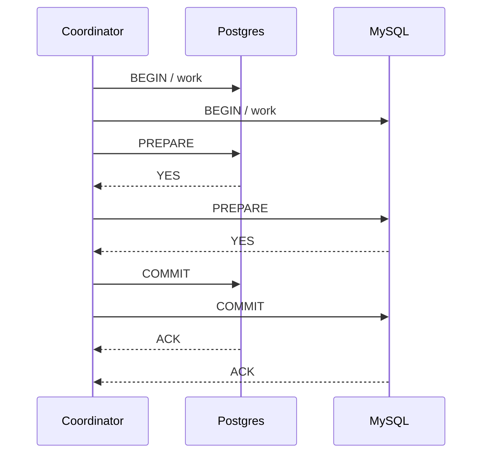

If you have ever booked a flight and a hotel in the same checkout, you already know the problem two-phase commit is trying to solve. Either both reservations succeed, or neither does. The airline taking the money while the hotel says no is not a product anyone wants.

That is a distributed transaction: two systems, two writes, one outcome. Two-phase commit (2PC) is the classic protocol for getting there. It looks airtight on a whiteboard. Then it spends the next decade making on-call worse.

## The shape of the protocol

You need a **coordinator** and one or more **participants**. In a database, the participants are the resource managers: Postgres, MySQL, a message broker that speaks XA. The coordinator is whoever is driving the transaction. The protocol really does have two phases.

**Phase 1, prepare.** The coordinator asks every participant: *can you commit this?* Each one does the local work, writes enough to durable storage that it could finish later, and answers yes or no. A yes is a promise. After that vote the participant is not allowed to abort on its own. It waits.

**Phase 2, commit or abort.** If every vote was yes, the coordinator writes a commit record and tells everyone to commit. If anyone said no, or timed out, it tells everyone to abort. Participants ack, the coordinator forgets the transaction, and we are done.

In the happy path it looks like this:



That is it. Two rounds, and you need *everyone*. No majority vote. That last part is the whole story.

## Why people reach for it

Local ACID is easy. `BEGIN`, write two rows, `COMMIT`. The database is the coordinator and the participant, and you do not think about it.

The moment those two rows live in two systems, that comfort disappears. You can commit the order and fail to charge the card. You can publish a message and roll back the row that said you published it. 2PC is the honest answer to "I want this to be one transaction anyway." XA, Java's JTA, MS DTC, Postgres prepared transactions: they are all this protocol with a vendor hat on.

I have seen it used for exactly that. An application had to write to two databases that were not going to be merged, and the business rule was "both or neither." 2PC will do that. It will also charge you for it.

## Where it falls over

**It blocks.** After a participant says yes, it holds locks and waits. If the coordinator dies in that window, those locks stay held until somebody comes back and finishes the protocol. Readers queue. Writers queue. Your latency graph does not care that the protocol is correct.

**The coordinator is a single point of failure.** You can replicate it. You can persist its log. You still have a component whose absence freezes in-flight work. Recovery is something you have to operate, not a footnote in the docs.

**Two extra round trips.** Prepare, then commit. On a LAN that is annoying. Across availability zones, or worse, regions, it is a tax on every write. People add 2PC to make things consistent, then spend a quarter wondering why p99 doubled.

**Participants can disagree with reality.** A yes vote is supposed to be durable. Disks lie, clocks lie, operators delete WAL files. A DBA aborting a prepared transaction by hand because the app is down (a heuristic decision) breaks the invariant the rest of the system is trusting.

**It does not compose with the way we build services now.** HTTP APIs, queues, third-party billing providers: most of them will not join your XA transaction. You cannot 2PC your way through Stripe. The boundary of the protocol is the boundary of what you actually control.

## The timeout nobody draws on the whiteboard

Every real implementation has a timeout. The coordinator cannot wait forever for a vote, so it aborts. Except a participant may have already voted yes and is now sitting on prepared work. Or the abort itself is lost. You now have a transaction in limbo, and the only honest state is "we do not know."

This is why 2PC is called a *blocking* protocol. Three-phase commit exists to shrink that window. It adds another round, more states, more ways to be wrong, and still cannot save you from a network that partitions at a bad time. FLP is not trivia from a distributed systems class. It is why your prepared transaction table is not empty on a bad afternoon.

## What I actually use

For two tables in the **same** Postgres database: a transaction. Not 2PC. A transaction. People reach for distributed machinery because the code is in two services, not because the data needed to be in two databases. Put the data together if you can. I would rather have an awkward join than a coordinator.

When the work really does cross a boundary, I treat it as what it is: **two local transactions plus a recovery story.**

The [transactional outbox](https://microservices.io/patterns/data/transactional-outbox.html) is the version of this I keep coming back to. Write the business row and an outbox row in one local commit. A worker publishes the outbox to the queue. Consumers are idempotent. If the worker dies, it resumes. You get at-least-once delivery and you write your handlers accordingly. That is a much smaller lie than "this is atomic across services."

Sagas are the other honest option. A sequence of local transactions, with compensating actions if a later step fails. Ugly compensations, explicit state, visible in the domain. I will take visible and ugly over a prepared transaction that has been sitting on a row lock since Friday.

Saga choreography through events is fine until you cannot explain who is in charge of the failure. Orchestrated sagas, with one process that knows the steps, are easier to debug at 2am. That is the only metric that matters once you are past the design review.

## A small picture in Laravel terms

Say you take an order and you need to reserve stock in a service you do not own. You do *not* start an XA transaction. You do this:

```php
DB::transaction(function () use ($order) {
    $order->markPaid();
    Outbox::record(new StockReserved($order->id));
});
```

A separate process reads `outbox`, publishes, and marks the row sent. The stock service reserves, or it doesn't. If it doesn't, you have a handler that knows how to refund and how to tell the customer. That handler is the protocol. It lives in your code, not in a spec from 1978.

Is that as clean as `COMMIT`? No. Does it survive a deploy in the middle of the work? Yes, if you wrote it that way. 2PC often does not, because the coordinator's log and your application's deploy are not the same thing, and nobody put that in the diagram.

## When 2PC is still the right tool

I am not going to pretend it never is. Two databases you already run, same region, a vendor that speaks XA well, a workload that cannot tolerate divergence even briefly, and an operations team that knows how to finish in-doubt transactions. That set is smaller than the set of systems that imported an XA library because a blog post said "distributed transaction."

If you are there, use the database's prepared transactions, monitor the in-doubt list like it is a paging condition, and keep the participants close. Do not run 2PC over the public internet. Do not run it against a system whose owner is another company. Do not run it because microservices made two writes look like they belong to two deployables.

## The part I want you to remember

Two-phase commit gives you a very specific guarantee: all of a known set of participants commit, or none do, assuming the coordinator can eventually talk to them. It does not give you availability. It does not give you a good time in a partition. It does not extend to the rest of your architecture for free.

Atomicity across processes is not a feature you turn on. It is a cost you pay, in latency and in operational burden, every time a write happens. Pay it only when the alternative is worse. For everything else, make the failure visible and recoverable. That is the work. The protocol was the easy part.
